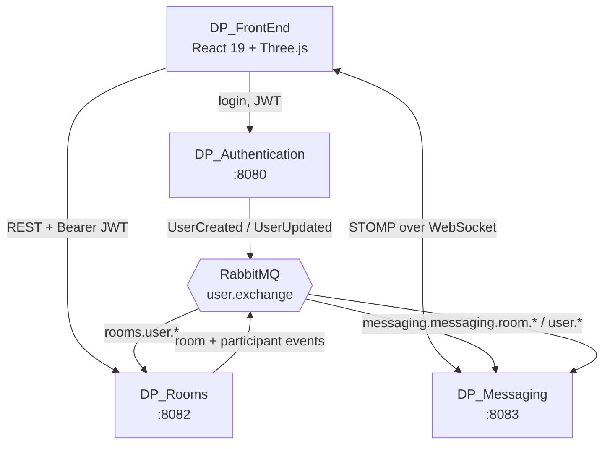

# DP_Rooms

**A real-time collaborative 3D piano — play together in the browser.**


🎹 **[Try it live →](https://duopiano.masemharuspex.com/)**


---

## The system

Duo Piano is four services. This repo owns rooms and participants.



Rooms and Messaging never call Auth on the request path. Each keeps a local
read-model projection of users (and, in Messaging, of rooms) built from
RabbitMQ events, and validates incoming JWTs against Auth's public keys. A
slow or restarting auth service cannot stall a piano session.

| Repo | Role | Port |
|---|---|---|
| [DP_Authentication](https://github.com/mkepg/DP_Authentication) | OAuth2 authorization server, user identity | 8080 |
| **DP_Rooms** ← you are here | Room lifecycle, participants, moderation | 8082 |
| [DP_Messaging](https://github.com/masem-haruspex/DP_Messaging) | Realtime messaging and live key events | 8083 |
| [DP_FrontEnd](https://github.com/masem-haruspex/DP_FrontEnd) | React 19 + React Three Fiber client | — |

## What this service does

- Creates rooms with a short join code, optionally password-protected
- Tracks participants: join, leave, kick, mute
- Enforces ownership — only a room's creator can delete it or remove people
- Consumes user events from RabbitMQ into a local projection, so no synchronous
  call to DP_Authentication is ever on the request path
- Validates JWTs issued by DP_Authentication as an OAuth2 resource server
- Per-endpoint rate limiting and correlation-ID logging


## Endpoints

All require a bearer token from DP_Authentication.

| Method | Path | Purpose |
|---|---|---|
| `POST` | `/api/rooms` | Create a room |
| `GET` | `/api/rooms/{code}` | Look a room up by join code |
| `GET` | `/api/rooms/{code}/participants` | List current participants |
| `POST` | `/api/rooms/{code}/join` | Join, with password if private |
| `POST` | `/api/rooms/{code}/leave` | Leave |
| `POST` | `/api/rooms/{code}/kick` | Remove a participant — owner only |
| `DELETE` | `/api/rooms/{roomId}` | Delete a room — owner only |

Interactive API docs at `/swagger-ui.html`.

## Staying in sync without calling Auth

`UserEventListener` consumes two queues bound to `user.exchange`:

| Queue | Effect |
|---|---|
| `rooms.user.created.queue` | Insert a `LocalUser` row |
| `rooms.user.updated.queue` | Update the cached username / preferences |

`LocalUser` is a read-model, not a second source of truth. It holds only what
room logic needs to render a participant list — no credentials, no tokens. It
means this service keeps working while DP_Authentication is down, and that a
participant list costs one local query rather than a network hop per user.

Room and participant changes are published back out, which is how DP_Messaging
knows a room exists and who belongs in it.

## Running locally

Needs **Java 17+**, **PostgreSQL**, **RabbitMQ**, and a running
[DP_Authentication](https://github.com/mkepg/DP_Authentication) to issue tokens.

```bash
createdb dp_rooms

cp src/main/resources/application.properties.example \
   src/main/resources/application.properties

./mvnw spring-boot:run
```

| Setting | Purpose |
|---|---|
| `DATABASE_USERNAME` / `DATABASE_PASSWORD` | PostgreSQL credentials |
| `RABBITMQ_USERNAME` / `RABBITMQ_PASSWORD` | Defaults to `guest` / `guest` |
| `FRONTEND_URL` | Allowed CORS origin |

Serves on **8082**; actuator binds separately to `127.0.0.1:9002`.
`spring.jpa.hibernate.ddl-auto=validate` — create the schema before first run.

## Known limitations

- Test coverage is a context-load test only.
- Room codes are generated without a global uniqueness retry loop under
  concurrent creation.

## Status

Part of [Duo Piano](https://duopiano.masemharuspex.com/), a personal project
currently live. All rights reserved — published to be read, not reused.
